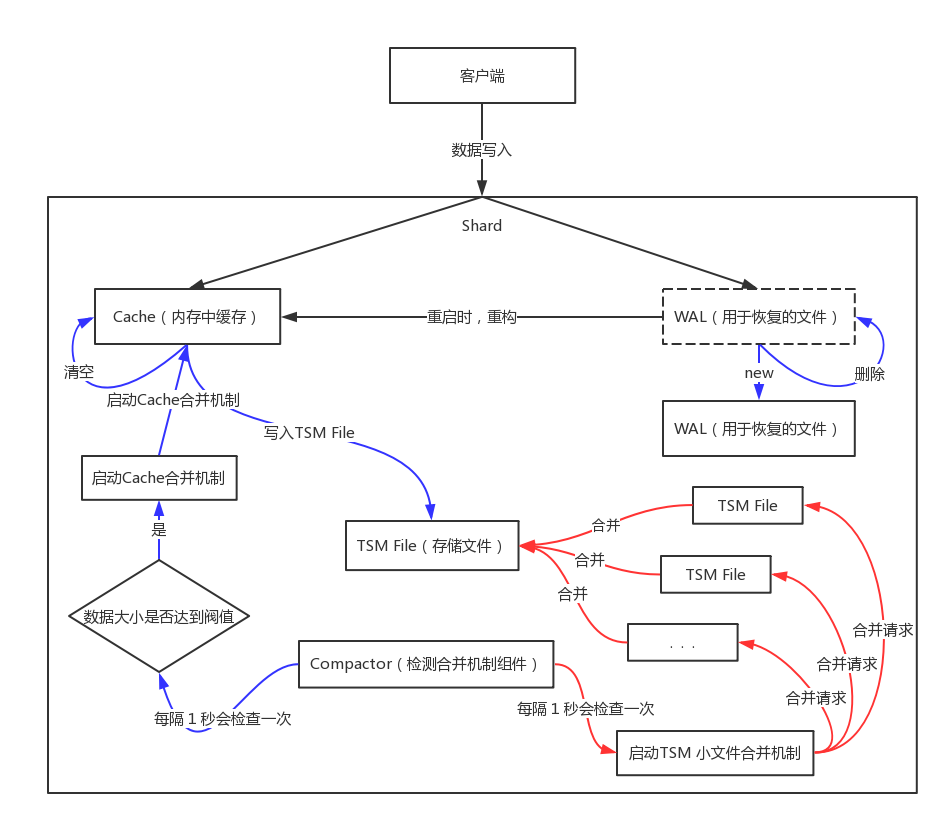
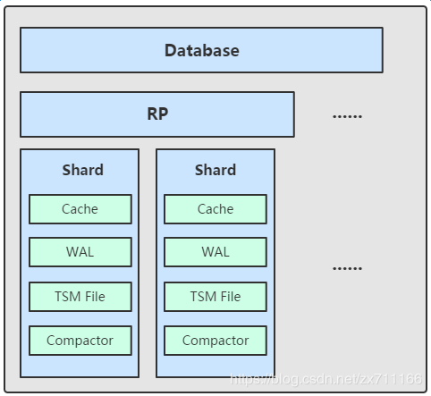
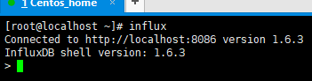
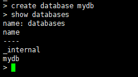

###                                               influxDB知识总结

#### 一、influxDB介绍

​         influxDB使用Go语言编写的一个开源分布式时序、事件和指标数据库，无需外部依赖。类似数据库有Elasticsearch、Graphite等。

功能特点：

1. 基于时间序列，支持与时间有关的相关函数（如最大，最小，求和等）。
2. 可度量性：你可以实时对大量数据进行计算。
3. 基于事件：它支持任意的事件数据基于事件：它支持任意的事件数据。

InfluxDB的主要特点：

1. 无结构（无模式）：可以是任意数量的列
2. 可拓展的
3. 支持min, max, sum, count, mean, median 等一系列函数，方便统计支持min, max, sum, count, mean, median 等一系列函数，方便统计
4. 原生的HTTP支持，内置HTTP API原生的HTTP支持，内置HTTP API
5. 强大的类SQL语法强大的类SQL语法
6. 自带管理界面，方便使用自带管理界面，方便使用

#### 二、InfluxDB与传统数据库的比较

| **InfluxDB的名词** | **串通数据库的概念** |
| ------------------ | -------------------- |
| database           | 数据库               |
| measurement        | 数据库中的表         |
| points             | 表里的一行数据       |

##### InfluxDB的独特的特性

- point

  Point相当于传统数据库里的一行数据，如下表所示：

  | **oint属性**         | **传统数据库中的概念**                                      |
  | -------------------- | ----------------------------------------------------------- |
  | time（时间戳）       | 每个数据记录时间，是数据库中的主索引(会自动生成)            |
  | fields（字段、数据） | 各种记录值（**没有索引的属性**）也就是记录的值：温度， 湿度 |
  | tags（标签）         | 各种有索引的属性：地区，海拔                                |

  **注意:**

  - 在influxdb中，字段必须存在。**因为字段是没有索引的。如果使用字段作为查询条件，会扫描符合查询条件的所有字段值，性能不及tag**。类比一下，fields相当于SQL的没有索引的列。

  - tags是可选的，但是强烈建议你用上它，因为tag是有索引的，tags相当于SQL中的有索引的列。tag value只能是string类型。

    

- series

  相当于是 InfluxDB 中一些数据的集合，在同一个 database 中，retention policy、measurement、tag sets 完全相同的数据同属于一个 series，同一个 series 的数据在物理上会按照时间顺序排列存储在一起。

- shard

  shard 和 retention policy 相关联。每一个存储策略下会存在许多 shard，每一个 shard 存储一个指定时间段内的数据，并且不重复；
  例如 7点-8点 的数据落入 shard0 中，8点-9点的数据则落入 shard1 中。
  每一个 shard 都对应一个底层的 tsm 存储引擎，有独立的 cache、wal、tsm file。

- 组件

  TSM 存储引擎主要由几个部分组成： cache、wal、tsm file、compactor。

  1. Cache：cache 相当于是 LSM Tree 中的 memtabl。插入数据时，实际上是同时往 cache 与 wal 中写入数据，可以认为 cache 是 wal 文件中的数据在内存中的缓存。当 InfluxDB 启动时，会遍历所有的 wal 文件，重新构造 cache，这样即使系统出现故障，也不会导致数据的丢失。
     cache 中的数据并不是无限增长的，有一个 maxSize 参数用于控制当 cache 中的数据占用多少内存后就会将数据写入 tsm 文件。如果不配置的话，默认上限为 25MB，每当 cache 中的数据达到阀值后，会将当前的 cache 进行一次快照，之后清空当前 cache 中的内容，再创建一个新的 wal 文件用于写入，剩下的 wal 文件最后会被删除，快照中的数据会经过排序写入一个新的 tsm 文件中。

     
     
     2. WAL：wal 文件的内容与内存中的 cache 相同，其作用就是为了持久化数据，当系统崩溃后可以通过 wal 文件恢复还没有写入到 tsm 文件中的数据。
     
     3. TSM File：单个 tsm file 大小最大为 2GB，用于存放数据。
     
     4. Compactor：compactor 组件在后台持续运行，每隔 1 秒会检查一次是否有需要压缩合并的数据。
        主要进行两种操作
     
        1. 一种是 cache 中的数据大小达到阀值后，进行快照，之后转存到一个新的 tsm 文件中。
     
        2. 另外一种就是合并当前的 tsm 文件，将多个小的 tsm 文件合并成一个，使每一个文件尽量达到单个文件的最大大小，减少文件的数量，并且一些数据的删除操作也是在这个时候完成。
     
           

#### 三、InfluxDB 客户端命令行方式操作

- InfluxDB数据库操作

  1. 客户端命令行方式操作

  2.  显示数据库 

  3. 新建数据库

​		   4. 删除数据库

​           5. 使用数据库

- InfluxDB 数据表操作

  在InfluxDB当中，并没有表（table）这个概念，取而代之的是measurement，measurement的功能与传统数据库中的表一致，因此我们也可以将measurement称为InfluxDB中的表。

  1. 显示所有表   show measurement

  2. 新建表

     InfluxDB中没有显示的创建表的语句，只能通过insert数据的房还是来建立新表。
     其中 **cpu 就是表名**，**hostname 是索引（tag）**，**value=xx 是记录值（field），记录值可以有多个**，**系统自带追加时间戳**。

     **增加数据采用insert的方式，要注意的是 InfluxDB的insert中，表名与数据之间用逗号（,）分隔，tag和field之间用 空格分隔，多个tag或者多个field之间用逗号（,）分隔。**

     

     **在这条语句中，disk_free是表名,hostname=server01是tag，属于索引，value=xx是field，这个可以随意写，随意定义。**

  3. 删除表   drop measurement cpu

  4. series操作

     series表示这个表里面的数据，可以在图表上画成几条线，series主要通过tags排列组合算出来。

     我们可以查询表的series，如下所示：

     

- 数据保存策略（Retention Policies）

  InfluxDB 是没有提供直接删除数据记录的方法，但是提供数据保存策略，主要用于指定数据保留时间，超过指定时间，就删除这部分数据。

  -   查看当前数据库Retention Policies

    - name：名称，此示例名称为 default。

    - duration：持续时间，0代表无限制。

    - shardGroupDuration：shardGroup的存储时间，shardGroup是InfluxDB的一个基本储存结构，应该大于这个时间的数据在查询效率上应该有所降低。

    - replicaN：全称是replication，副本个数。

    - default：是否是默认策略。

      

- 创建新的Retention Policies

  - rp_name：策略名。

  - db_name：具体的数据库名。

  - 3w：保存3周，3周之前的数据将被删除，influxdb 具备各种事件参数，**持续时间必须至少为1小时**；比如：h（小时）、d（天）、w（星期）。

  - replication 1：副本个数，一般为1即可。

  - default：设置为默认策略。

    

- 修改Retention Policies

  

- 删除Retention Policies

  

#### 四、influxdb连续查询

- 连续查询的定义

  InfluxDB的连续查询是在数据库中自动定时启动的一组语句，语句中必须包含 `SELECT `关键词和` GROUP BY time() `关键词。InfluxDB会将查询结果放在指定的数据表中。

- 连续查询的目的

  使用连续查询是最优的降低采样率的方式，连续查询和存储策略搭配使用将会大大降低InfluxDB的系统占用量。而且使用连续查询后，数据会存放到指定的数据表中，这样就为以后统计不同精度的数据提供了方便。

- 连续查询-操作

  只有[管理](https://www.linuxdaxue.com/tag/管理/)员用户可以操作 连续查询。

  - 新建连续查询

    新建连续查询的语法如下所示：

    ```sql
    CREATE CONTINUOUS QUERY <cq_name> ON <database_name> 
    [RESAMPLE [EVERY <interval>] [FOR <interval>]] 
    BEGIN SELECT <function>(<stuff>)[,<function>(<stuff>)] INTO <different_measurement> 
    FROM <current_measurement> [WHERE <stuff>] GROUP BY time(<interval>)[,<stuff>] 
    END
    ```

​           查询部分被 CREATE CONTINUOUS QUERY [...] BEGIN 和 END 所包含，主要的逻辑代码也是在这一部分。


​          示例在telegraf库中新建了一个名为 computer 的连续查询，每三十分钟取查询results表中数据，加入 all_computer 表中。使用的数据保留策略都是 default。

- 显示所有已存在的连续查询

  查询所有连续查询可以使用如下语句：

  

​        可以看到其连续查询的名称以及 语句等信息。

- 删除Continuous Queries

  删除连续查询的语句如下：

  ```sql
  DROP CONTINUOUS QUERY <cq_name> ON <database_name>
  ```


#### 五、其他说明

在InfluxDB中，将连续查询与数据存储策略一起使用会达到最好的效果。

比如，将精度高的表的存储策略定为一个周，然后将精度底的表存储策略定的时间久一点，这要就可以实现高低搭配，以满足不同的工作需要。

#### 六、influxDB常用函数

- count()函数

  返回一个（field）字段中的非空值的数量。语法：

  ```sql
  SELECT COUNT(<field_key>) FROM <measurement_name> [WHERE <stuff>] [GROUP BY <stuff>]
  ```


说明 value2这个字段在 results表中共有1条数据。

可以在where 中加入时间条件，如下：

```sql
SELECT COUNT(value2) FROM results WHERE time >= '2019-08-18T00:00:00Z' AND time < '2019-09-18T17:00:00Z' GROUP BY time(4d)
```

- distinct()函数

  返回一个字段（field）的唯一值。语法：

  ```sql
  SELECT DISTINCT(<field_key>) FROM <measurement_name> [WHERE <stuff>] [GROUP BY <stuff>]
  ```


- mean()函数

  返回一个字段（field）中的值的算术平均值（平均值）。字段类型必须是长整型或float64。

  语法格式：

  ```sql
  SELECT MEAN(<field_key>) FROM <measurement_name> [WHERE <stuff>] [GROUP BY <stuff>]
  ```


- median()函数

  从单个字段（field）中的排序值返回中间值（中位数）。字段值的类型必须是长整型或float64格式。

  语法：

```sql
SELECT MEDIAN(<field_key>) FROM <measurement_name> [WHERE <stuff>] [GROUP BY <stuff>]
```


- spread()函数

  返回字段的最小值和最大值之间的差值。数据的类型必须是长整型或float64。语法：

  ```sql
  SELECT SPREAD(<field_key>) FROM <measurement_name> [WHERE <stuff>] [GROUP BY <stuff>]
  ```


- sum()函数

  返回一个字段中的所有值的和。字段的类型必须是长整型或float64。语法：

  ```sql
  SELECT SUM(<field_key>) FROM <measurement_name> [WHERE <stuff>] [GROUP BY <stuff>]
  ```

  

